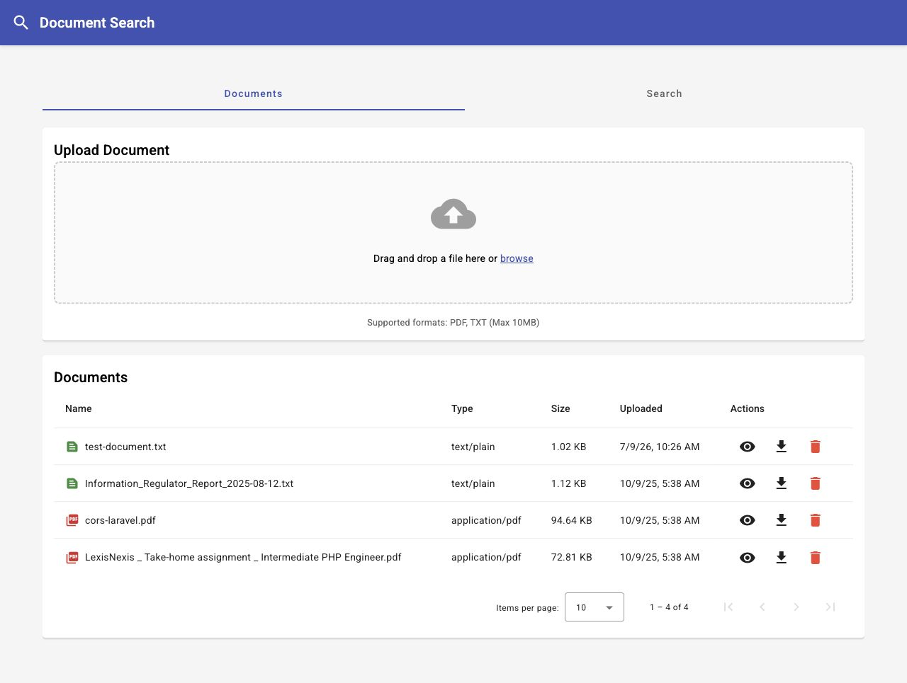
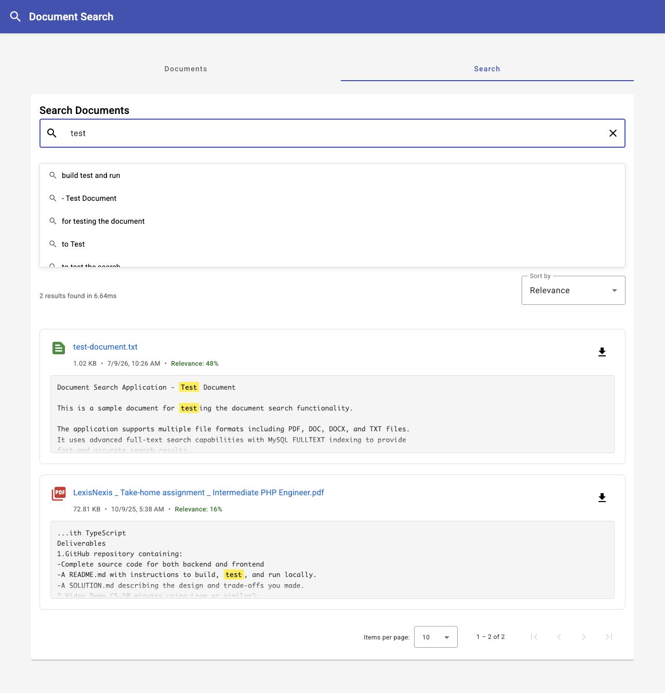
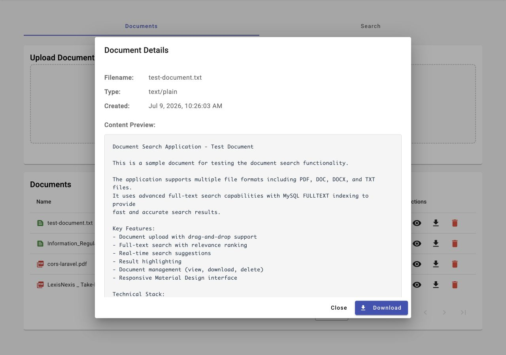

# Document Search Portal

A full-stack document search application with **PHP 8.0+ backend** and **Angular 16+ frontend**. Upload documents (PDF and TXT), and perform full-text search with context-aware suggestions and highlighted results.

## Portfolio Proof

This repository is being prepared as a public portfolio case study for backend-heavy product work. It demonstrates REST API design, file upload safety, document parsing, MySQL FULLTEXT search, result caching, Angular integration, and clear setup documentation.

- Case study: [docs/CASE_STUDY.md](docs/CASE_STUDY.md)
- Proof checklist: [docs/PROOF_CHECKLIST.md](docs/PROOF_CHECKLIST.md)
- Local verification log: [docs/LOCAL_VERIFICATION.md](docs/LOCAL_VERIFICATION.md)
- Architecture decisions: [SOLUTION.md](SOLUTION.md)

Current proof status:

- Public repository: available.
- Setup and architecture docs: available.
- Screenshots: available below.
- Live demo: not available yet.
- Verification output: recorded in [docs/LOCAL_VERIFICATION.md](docs/LOCAL_VERIFICATION.md).
- Measured proof: documented in [docs/CASE_STUDY.md](docs/CASE_STUDY.md#proof-and-outcomes).

### Visual Proof

#### Document Upload And Listing



#### Search Suggestions And Highlighted Results



#### Document Detail Modal



## 🎯 Overview

This application demonstrates a production-ready document management and search system featuring:
- **Smart Search**: MySQL FULLTEXT with intelligent LIKE fallback for short queries
- **Context-Aware Suggestions**: Extracts meaningful phrases from document content
- **Modern Architecture**: Service-oriented backend, component-based frontend
- **Performance**: Search caching, debounced input, efficient pagination

## Features

### Backend (PHP 8.0+)
- ✅ RESTful API with custom routing
- ✅ Document upload and parsing (PDF and TXT)
- ✅ MySQL FULLTEXT search with intelligent LIKE fallback
- ✅ Context-aware search suggestions from document content
- ✅ Result highlighting with match context
- ✅ Search result caching (5-minute TTL)
- ✅ CORS support
- ✅ Comprehensive error handling

### Frontend (Angular 16+)
- ✅ Drag-and-drop file upload
- ✅ Document management (list, view, download, delete)
- ✅ Pagination for documents and search results
- ✅ Real-time search with debouncing (300ms)
- ✅ Smart auto-suggestions
- ✅ Search result highlighting
- ✅ Sort by relevance or date
- ✅ Performance metrics display
- ✅ Responsive Material Design UI
- ✅ Loading states and error handling

## Tech Stack

**Backend:**
- PHP 8.0+
- MySQL 5.7+ / MariaDB 10.2+ with FULLTEXT indexing
- Composer packages:
  - `smalot/pdfparser` - PDF content extraction
  - `vlucas/phpdotenv` - Environment configuration

**Frontend:**
- Angular 16+
- TypeScript 5.1+
- Angular Material 16
- RxJS 7.8
- ESLint with angular-eslint

## Quick Start

### Prerequisites

Ensure you have the following installed:
- ✅ PHP 8.0+ with extensions: PDO, pdo_mysql, mbstring, fileinfo
- ✅ MySQL 5.7+ or MariaDB 10.2+ (with FULLTEXT support)
- ✅ Composer (dependency management)
- ✅ Node.js 16+ and npm
- ✅ Angular CLI 16+ (`npm install -g @angular/cli`)

### 🚀 Automated Setup (Recommended)

**The fastest way to get started:**

```bash
chmod +x setup.sh
./setup.sh
```

This script will:
- ✅ Check all prerequisites
- ✅ Install backend dependencies (composer)
- ✅ Install frontend dependencies (npm)
- ✅ Create necessary directories (uploads/, cache/)
- ✅ Set up configuration files (.env)
- ✅ Display next steps for database setup

**After running the script, follow the displayed instructions to:**
1. Configure your database credentials in `backend/.env`
2. Create the database and run migrations
3. Start the backend and frontend servers

---

### Manual Setup (Alternative)

If you prefer manual setup or the automated script fails:

#### Manual Backend Setup

1. Navigate to backend directory and install dependencies:
```bash
composer install
```

3. Configure environment:
```bash
cp .env.example .env
# Edit .env with your database credentials
```

4. Create database:
```bash
mysql -u root -p
CREATE DATABASE document_search CHARACTER SET utf8mb4 COLLATE utf8mb4_unicode_ci;
exit;
```

5. Run migrations:
```bash
# Option A: Use the migration script (easiest)
cd backend
chmod +x migrate.sh
./migrate.sh

# Option B: Manual SQL command
mysql -u root -p document_search < migrations/001_create_documents_table.sql
```

6. Set permissions:
```bash
chmod -R 755 uploads/
chmod -R 755 cache/
```

7. Start PHP server:
```bash
# From backend directory
php -S localhost:8000 -t public

# Or if you prefer the traditional way
cd public && php -S localhost:8000
```

Backend API will be available at `http://localhost:8000`

### Frontend Setup

1. Navigate to frontend directory:
```bash
cd frontend
```

2. Install dependencies:
```bash
npm install
```

3. Start development server:
```bash
npm start
```

Frontend will be available at `http://localhost:4200`

## Project Structure

```
document-search/
├── backend/                    # PHP Backend
│   ├── public/
│   │   ├── index.php          # API entry point & routing
│   │   └── .htaccess          # Apache rewrite rules
│   ├── src/
│   │   ├── Controllers/
│   │   │   └── DocumentController.php
│   │   ├── Services/
│   │   │   ├── StorageService.php     # Database operations
│   │   │   ├── ParserService.php      # PDF & TXT parsing
│   │   │   ├── SearchService.php      # Search & suggestions
│   │   │   └── CacheService.php       # Result caching
│   │   ├── Helpers/
│   │   │   ├── ResponseHelper.php     # JSON responses
│   │   │   └── Router.php             # Custom routing
│   │   └── bootstrap.php              # App initialization
│   ├── migrations/
│   │   └── 001_create_documents_table.sql
│   ├── uploads/               # Uploaded files storage
│   ├── cache/                 # Search cache files
│   ├── composer.json          # PHP dependencies
│   ├── .env.example           # Environment config template
│   ├── README-backend.md      # Backend documentation
│   └── SOLUTION-backend.md    # Backend design decisions
│
├── frontend/                  # Angular Frontend
│   ├── src/
│   │   ├── app/
│   │   │   ├── models/
│   │   │   │   └── document.model.ts  # TypeScript interfaces
│   │   │   ├── services/
│   │   │   │   ├── document.service.ts
│   │   │   │   └── search.service.ts
│   │   │   ├── interceptors/
│   │   │   │   └── api-response.interceptor.ts
│   │   │   └── modules/
│   │   │       ├── documents/
│   │   │       │   ├── uploader/
│   │   │       │   ├── document-list/
│   │   │       │   └── document-details/
│   │   │       └── search/
│   │   │           ├── search.component.ts
│   │   │           ├── search.component.html
│   │   │           └── search.component.scss
│   │   └── environments/
│   │       ├── environment.ts
│   │       └── environment.prod.ts
│   ├── package.json           # Node dependencies
│   ├── angular.json           # Angular config
│   ├── eslint.config.js       # ESLint configuration
│   ├── README-frontend.md     # Frontend documentation
│   └── SOLUTION-frontend.md   # Frontend design decisions
│
├── README.md                  # Main documentation (this file)
├── SOLUTION.md               # Overall design & architecture
├── setup.sh                  # Automated setup script
└── test-document.txt         # Sample test file
```

## API Endpoints

### Documents
- `POST /api/documents/upload` - Upload a document
- `GET /api/documents?page={page}&limit={limit}` - List documents
- `GET /api/documents/{id}` - Get document details
- `DELETE /api/documents/{id}` - Delete document
- `GET /api/documents/{id}/download` - Download document

### Search
- `GET /api/search?q={query}&sort={relevance|date}&page={page}&limit={limit}` - Full-text search
- `GET /api/suggestions?q={query}&limit={limit}` - Get context-aware search suggestions

## Usage

1. **Upload Documents**: 
   - Go to the "Documents" tab
   - Drag and drop files or click to browse
   - Supported formats: **PDF and TXT only** (max 10MB)

2. **Manage Documents**:
   - View uploaded documents in the list
   - Click view icon to see document details
   - Download or delete documents as needed

3. **Search Documents**:
   - Go to the "Search" tab
   - Enter search terms (minimum 2 characters)
   - See context-aware suggestions as you type
   - Click suggestions for instant search
   - View results with highlighted matches
   - Sort by relevance or date
   - Download documents directly from results

## Configuration

### Backend (.env)
```env
DB_HOST=localhost
DB_PORT=3306
DB_NAME=document_search
DB_USER=root
DB_PASS=your_password

UPLOAD_DIR=uploads
ALLOWED_EXTENSIONS=pdf,txt  # Only PDF and TXT supported
MAX_FILE_SIZE=10485760      # 10MB in bytes

CORS_ORIGIN=http://localhost:4200
```

### Frontend (environment.ts)
```typescript
export const environment = {
  production: false,
  apiUrl: 'http://localhost:8000/api'
};
```

## Testing

### Backend API Testing

**Option 1: Automated Test Script (Recommended)**

Use the included test script to test all API endpoints:

```bash
cd backend
chmod +x test-api.sh
./test-api.sh
```

This script will:
- ✅ Check if backend server is running
- ✅ Test document upload
- ✅ Test document listing
- ✅ Test search functionality
- ✅ Test search suggestions
- ✅ Display HTTP status codes and responses

**Option 2: Manual Testing with curl**

Test individual endpoints:

```bash
# Upload document
curl -X POST http://localhost:8000/api/documents/upload \
  -F "file=@test-document.txt"

# List documents
curl "http://localhost:8000/api/documents?page=1&limit=10"

# Search
curl "http://localhost:8000/api/search?q=test&sort=relevance"

# Get suggestions
curl "http://localhost:8000/api/suggestions?q=test&limit=5"

# Download document
curl "http://localhost:8000/api/documents/1/download" -o downloaded.pdf
```

### Frontend Testing

```bash
cd frontend

# Run unit tests
npm test

# Run linter (checks code quality)
npm run lint
```

**Expected Results:**
- All unit tests should pass
- Linter should report 0 errors

## Database Migrations

### Refresh Migrations (Reset Database)

If you need to refresh the database schema or reset all data:

```bash
cd backend
chmod +x migrate.sh
./migrate.sh
```

This script will:
- ⚠️ **Drop the existing database** (all data will be lost)
- ✅ Create a fresh database
- ✅ Run all migrations
- ✅ Set up FULLTEXT indexes

**Note:** Your backend server (if running) will automatically work with the refreshed database. No restart needed.

### Alternative: Manual Migration Refresh

```bash
# Drop and recreate database
mysql -u root -p -e "DROP DATABASE IF EXISTS document_search; CREATE DATABASE document_search CHARACTER SET utf8mb4 COLLATE utf8mb4_unicode_ci;"

# Run migrations
mysql -u root -p document_search < backend/migrations/001_create_documents_table.sql
```

## Production Deployment

### Backend
1. Configure Apache/Nginx virtual host pointing to `backend/public`
2. Set up environment variables
3. Ensure proper file permissions for uploads directory
4. Enable MySQL FULLTEXT indexing

### Frontend
1. Build for production:
```bash
cd frontend
npm run build
```
2. Deploy `dist/` contents to web server
3. Update `environment.prod.ts` with production API URL

## Troubleshooting

**Database Connection Issues:**
- Verify MySQL credentials in `.env`
- Ensure database exists and migrations are run
- Check MySQL service is running

**File Upload Issues:**
- Check PHP `upload_max_filesize` and `post_max_size` settings
- Verify uploads and cache directory permissions (755)
- Ensure allowed file extensions in `.env` (only pdf,txt)
- Only PDF and TXT files are supported

**CORS Issues:**
- Verify `CORS_ORIGIN` in backend `.env` matches frontend URL
- Check browser console for CORS errors

**Search Not Working:**
- Ensure FULLTEXT index is created (check migrations)
- Verify documents have content extracted
- Check MySQL FULLTEXT minimum word length settings

## Proof And Outcomes

This repository is used as portfolio proof for backend-heavy product work. Current verified outcomes:

- Implements 7 REST API actions across document upload, listing, details, delete, download, search, and suggestions.
- Uses MySQL FULLTEXT indexing on extracted document content, with LIKE fallback for short queries that FULLTEXT may ignore.
- Supports PDF and TXT uploads up to 10MB through backend file validation.
- Returns `searchTime` and `cached` metadata in API responses so search behavior can be inspected during testing.
- Caches repeated search responses for 5 minutes using a file-based cache layer.
- Uses 300ms frontend search debouncing to avoid firing a request on every keystroke.
- Local API verification confirmed upload, list, search, and suggestions returned successful HTTP responses.
- Follow-up API verification confirmed document detail, PDF upload, PDF download, and delete workflows.
- Temporary database migration proof confirmed the `documents` table, BTREE indexes, and FULLTEXT content index are created from the migration SQL.
- Local frontend verification confirmed document listing, suggestions, highlighted search results, lint, and production build.
- Browser verification confirmed the document detail modal renders with a content preview and download action.

Not yet claimed:

- No production benchmark has been captured yet for large datasets.
- No public live demo is available yet.
- A public walkthrough video is still optional future proof.

## 🔒 Security Features

- ✅ SQL injection prevention (PDO prepared statements)
- ✅ File upload validation (type, size, extension)
- ✅ CORS configuration
- ✅ Path traversal prevention
- ✅ Unique filename generation
- ✅ Safe error messages

## 📚 Additional Documentation

- **[SOLUTION.md](SOLUTION.md)** - Overall architecture and design decisions
- **[backend/README-backend.md](backend/README-backend.md)** - Backend-specific documentation
- **[backend/SOLUTION-backend.md](backend/SOLUTION-backend.md)** - Backend design and trade-offs
- **[frontend/README-frontend.md](frontend/README-frontend.md)** - Frontend-specific documentation
- **[frontend/SOLUTION-frontend.md](frontend/SOLUTION-frontend.md)** - Frontend design and trade-offs

## 💡 Key Technical Highlights

1. **Custom PHP Router**: Regex-based pattern matching for clean RESTful routes
2. **Smart Suggestions**: Extracts contextual phrases from document content, not just filenames
3. **Intelligent Search**: Automatic fallback from FULLTEXT to LIKE for short queries
4. **Reactive Search**: RxJS pipeline with debouncing, timeout, and error recovery
5. **Modern Angular**: Uses `inject()` function instead of constructor injection
6. **Search Caching**: File-based cache with 5-minute TTL for performance
7. **Accessibility**: WCAG compliant with keyboard navigation and ARIA labels

## Project Information

**Purpose**: Full Stack Developer Assessment  
**Technologies**: PHP 8.0+, Angular 16+, MySQL
