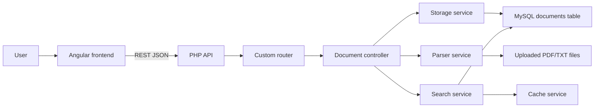

# Document Search Portal Case Study

## Portfolio Summary

Document Search Portal is a full-stack document management and search application built with a PHP REST API, MySQL FULLTEXT search, and an Angular frontend. It lets users upload PDF and TXT files, extract searchable content, search across documents, view highlighted matches, and manage uploaded files through a responsive interface.

## Problem

Teams often store important information inside scattered PDF and text files. Without a searchable interface, finding a policy, clause, instruction, or reference requires opening files manually and guessing where the right information lives.

## Solution

This project turns uploaded documents into searchable records. The backend parses document content, stores metadata and extracted text, indexes content in MySQL, and exposes REST endpoints for upload, search, suggestions, document listing, deletion, and download. The frontend gives users a practical interface for uploading, browsing, searching, sorting, and reading highlighted results.

## What I Built

- A PHP API with custom routing and service-oriented backend structure.
- Document upload validation for file type, file size, and storage safety.
- PDF and TXT parsing through backend parser services.
- MySQL FULLTEXT search with fallback matching for shorter queries.
- Context-aware suggestions based on document content.
- File-based search caching to reduce repeated lookup cost.
- Angular document upload, list, detail, and search workflows.
- Debounced search input, loading states, pagination, and error handling.
- Setup scripts and documentation for local installation and API testing.

## Architecture

## Technical Decisions

- **PHP without a large framework:** Keeps the API small and makes routing, services, and request handling easy to inspect.
- **Service layer:** Keeps parsing, storage, search, and cache logic out of controller methods.
- **MySQL FULLTEXT:** Provides search relevance without adding Elasticsearch or another search service.
- **LIKE fallback:** Improves short-query behavior when FULLTEXT minimum word length would be too restrictive.
- **Debounced Angular search:** Reduces unnecessary requests while keeping the UI responsive.
- **File cache:** Speeds up repeated searches and demonstrates practical performance thinking.

## Stack

- PHP 8
- MySQL / MariaDB
- PDO
- Composer
- `smalot/pdfparser`
- Angular 16
- TypeScript
- Angular Material
- RxJS

## Proof And Outcomes

Verified proof currently available in this repository:

- **7 API actions implemented:** upload, list, detail, delete, download, search, and suggestions.
- **8 API workflow checks locally verified:** TXT upload, document listing, search, suggestions, detail, PDF upload, PDF download, and delete.
- **Fresh migration proof:** the migration SQL was run against a temporary database and confirmed the `documents` table, BTREE indexes, and FULLTEXT content index.
- **Search architecture:** MySQL FULLTEXT index on extracted document content, plus LIKE fallback for short queries and filename/content matching.
- **Search response observability:** API responses include `searchTime` and `cached` fields so repeated searches can be inspected during testing.
- **Caching:** repeated search responses are cached for 5 minutes through the file-based cache service.
- **Upload guardrails:** PDF/TXT upload validation, file size limit, and unique stored filenames.
- **Frontend behavior verified:** document listing, document detail modal, search suggestions, highlighted matches, lint, and production build.
- **Public proof assets:** screenshots for document listing, search results, and document detail are committed under `docs/proof-assets/`.

Honest limitations:

- No production benchmark has been captured yet, so the project should not claim large-dataset performance numbers.
- No public live demo is available yet.
- A public walkthrough video is still optional future proof.

## Proof To Capture

- Screenshot of the document upload/list flow: `docs/proof-assets/document-list.jpg`.
- Screenshot of search suggestions and highlighted matches: `docs/proof-assets/search-results.jpg`.
- Screenshot of the document detail modal: `docs/proof-assets/document-detail.png`.
- API verification output from `backend/test-api.sh`: recorded in `docs/LOCAL_VERIFICATION.md`.
- Frontend build/lint output: recorded in `docs/LOCAL_VERIFICATION.md`.
- Fresh-database migration output: recorded in `docs/LOCAL_VERIFICATION.md`.
- PDF upload, document download, detail, and delete verification output: recorded in `docs/LOCAL_VERIFICATION.md`.
- Optional short walkthrough video.

## Portfolio Positioning

This project proves that I can build useful backend-heavy product features, not only static interfaces. It shows REST API design, file handling, parsing, database search, caching, Angular integration, and practical documentation.
